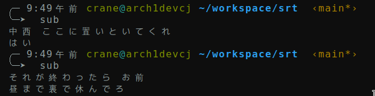

# What is it

I'm self-learning Japanese. I use [`mpd`](https://wiki.archlinux.org/title/Music_Player_Daemon) with `mpc` to play audio files which I extracted from Japanese movies. Often I need to check out subtitles when I can not clearly understand what I just heard. This tool `srt` plus the helper script `sub`, queries and print the corresponding subtitle at the time of current playing audio.

It assumes your subtitle files are under "$HOME/subtitles/", and have the same base name of the audio files. However, you can modify `sub` script easily as your needs.

# Usage

1. Build `srt` with `go build`.
2. Copy/move `srt` and `sub` to somewhere under you `$PATH`.
3. Run `sub` to print the subtitle at current point:

   
